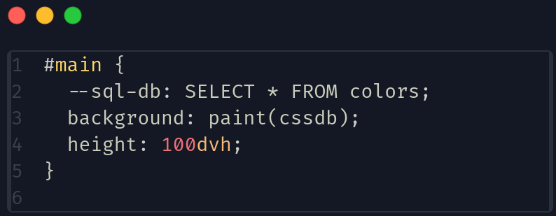

# Challenge de conexion a base de datos con CSS

## Descripción

Este proyecto es un reto de conexion a una base de datos usando CSS, en el cual se debe realizar una conexión a una base de datos
de SQL local y mostrar el resultado en una tabla llamada "colors". Para poder realizarlo se hara uso de los **worklets paint** de CSS.

## Requerimientos

- Node.js >= 20.0.0
- NPM >= 10.0.0

## Instalación

Para instalar el proyecto se debe clonar el repositorio y ejecutar el siguiente comando:

```bash
npm install
```

## Ejecución

```bash
npm start
```

## Ejemplo de consulta



Obtenemos de salida lo siguiente:


## Conclusiones

En este reto se pudo realizar la conexión a una base de datos y mostrar el resultado de una tabla, se pudo hacer uso de los worklets paint de CSS para poder realizar la consulta a la base y mostrar el resultado en pantalla.
